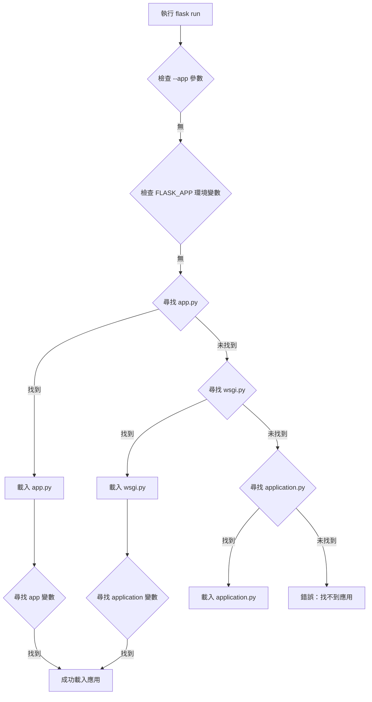

# Flask應用發現機制詳解

## 🤔 問題：`flask run` 是怎麼知道要執行哪一個文檔？

當你在終端執行 `flask run` 命令時，Flask需要知道要載入哪個Python文件作為應用程式的入口點。這個過程稱為「應用發現機制」。

## 🔍 Flask應用發現機制

### 預設搜尋順序

Flask會按照以下優先順序尋找應用：

```
1. --app 命令行參數
2. FLASK_APP 環境變數
3. 當前目錄中的預設文件：
   ├── app.py          (最優先)
   ├── wsgi.py         (次優先)
   └── application.py  (第三優先)
```

### 變數名稱搜尋規則

在找到目標文件後，Flask會尋找以下變數名稱：

```python
# 按優先順序搜尋：
app          # 最常用的變數名
application  # WSGI標準變數名
create_app   # 工廠函數（會自動調用）
make_app     # 另一種工廠函數名稱
```

## 📁 本專案的應用發現過程

### 專案文件結構
```
專案根目錄/
├── app.py          ✅ Flask會首先找到這個文件
├── wsgi.py         ✅ 備用入口點
├── config.py
├── .env
└── app/
    ├── __init__.py
    ├── auth/
    └── models/
```

### 當執行 `flask run` 時的發現流程



## 📋 本專案的具體分析

### 1. app.py 文件內容
```python
# app.py - Flask的首選入口點
from app import create_app

app = create_app()  # ← Flask會找到這個 'app' 變數

if __name__ == '__main__':
    app.run(debug=True)
```

### 2. wsgi.py 文件內容
```python
# wsgi.py - 部署用的入口點
from app import create_app

application = create_app()  # ← Flask會找到這個 'application' 變數

if __name__ == "__main__":
    application.run()
```

### 3. .env 環境變數
```properties
# .env 文件內容
SECRET_KEY=your-secret-key-here
FLASK_ENV=development
DATABASE_URL=sqlite:///app.db
# 注意：沒有設定 FLASK_APP，所以使用預設發現機制
```

## 🛠️ 不同的應用啟動方式

### 方式1：使用預設發現機制
```bash
# Flask自動找到 app.py 中的 app 變數
flask run
```

### 方式2：直接執行Python文件
```bash
# 執行 app.py 中的 if __name__ == '__main__': 部分
python app.py
```

### 方式3：使用命令行參數指定
```bash
# 指定特定文件
flask --app wsgi.py run

# 指定模組
flask --app app run

# 指定工廠函數
flask --app "app:create_app" run
```

### 方式4：使用環境變數
```bash
# Linux/Mac
export FLASK_APP=app.py
flask run

# Windows CMD
set FLASK_APP=app.py
flask run

# Windows PowerShell
$env:FLASK_APP="app.py"
flask run
```

## 🔧 環境變數配置詳解

### FLASK_APP 環境變數的不同格式

```bash
# 1. 指定文件名
FLASK_APP=app.py

# 2. 指定模組名
FLASK_APP=app

# 3. 指定工廠函數
FLASK_APP="app:create_app"

# 4. 帶參數的工廠函數
FLASK_APP="app:create_app('development')"

# 5. 指定包中的模組
FLASK_APP="mypackage.app:create_app"
```

### 在 .env 文件中配置
```properties
# .env 文件
FLASK_APP=app.py
FLASK_ENV=development
FLASK_DEBUG=1
```

## 📊 應用發現的完整流程圖

```
flask run 命令
    ↓
1. 檢查命令行 --app 參數
    ↓ (如果沒有)
2. 檢查 FLASK_APP 環境變數
    ↓ (如果沒有)
3. 在當前目錄搜尋預設文件
    ↓
    ├── app.py 存在？ ✅
    │   ↓
    │   在 app.py 中搜尋變數：
    │   ├── app ✅
    │   ├── application
    │   ├── create_app
    │   └── make_app
    │   ↓
    │   載入成功 ✅
    │
    ├── wsgi.py 存在？ ✅ (備用)
    │   ↓
    │   在 wsgi.py 中搜尋變數：
    │   ├── application ✅
    │   ├── app
    │   └── create_app
    │
    └── application.py 存在？
        ↓ (如果都沒找到)
        錯誤：無法找到Flask應用
```

## 🧪 驗證應用發現結果

### 檢查Flask找到的路由
```bash
# 顯示所有註冊的路由
flask routes
```

輸出結果：
```
Endpoint          Methods    Rule
----------------  ---------  -----------------------
auth.login        GET, POST  /auth/login
auth.logout       GET        /auth/logout
auth.register     GET, POST  /auth/register
index             GET        /
static            GET        /static/<path:filename>
user.create_user  GET, POST  /user/create
user.delete_user  POST       /user/<int:id>/delete
user.edit_user    GET, POST  /user/<int:id>/edit
user.user_detail  GET        /user/<int:id>
user.user_list    GET        /user/list
```

### 檢查Flask配置
```bash
# 進入Flask shell
flask shell

# 在shell中檢查應用
>>> app
<Flask 'app'>
>>> app.config['SECRET_KEY']
'your-secret-key-here'
```

## ⚠️ 常見問題與解決方案

### 問題1：找不到Flask應用
```bash
Error: Could not locate a Flask application.
```

**解決方案：**
```bash
# 方法1：確保有 app.py 文件且包含 app 變數
# 方法2：設定 FLASK_APP 環境變數
export FLASK_APP=your_app.py

# 方法3：使用 --app 參數
flask --app your_app.py run
```

### 問題2：找到錯誤的應用
```bash
# 如果有多個可能的入口點，Flask可能載入錯誤的文件
```

**解決方案：**
```bash
# 明確指定要使用的應用
flask --app app.py run
```

### 問題3：工廠函數未被調用
```python
# 如果你的 app.py 只有工廠函數
def create_app():
    return Flask(__name__)

# Flask無法自動找到應用實例
```

**解決方案：**
```python
# 方法1：創建應用實例
def create_app():
    return Flask(__name__)

app = create_app()  # 添加這行

# 方法2：使用環境變數指定工廠函數
# FLASK_APP="app:create_app"
```

## 🎯 最佳實踐建議

### 1. 標準文件命名
```python
# 推薦的入口點文件名
app.py          # 開發環境首選
wsgi.py         # 生產環境部署
application.py  # 替代選項
```

### 2. 標準變數命名
```python
# 推薦的應用變數名
app = create_app()          # 最常用
application = create_app()  # WSGI標準
```

### 3. 環境變數設定
```bash
# 在 .env 文件中明確指定
FLASK_APP=app.py
FLASK_ENV=development
FLASK_DEBUG=1
```

### 4. 工廠模式最佳實踐
```python
# app.py
from app import create_app

# 創建應用實例供Flask發現
app = create_app()

# 支援直接執行
if __name__ == '__main__':
    app.run(debug=True)
```

## 📚 總結

在你的專案中，`flask run` 能夠正常工作的原因：

1. ✅ **存在 `app.py` 文件** - Flask的預設搜尋目標
2. ✅ **`app.py` 中有 `app` 變數** - Flask認識的標準變數名
3. ✅ **`app` 變數是Flask應用實例** - 通過 `create_app()` 工廠函數創建
4. ✅ **應用正確配置** - 所有藍圖和路由都已註冊

這個發現機制讓Flask能夠自動找到並載入你的應用，無需額外配置。理解這個機制有助於：

- 🔧 **調試應用啟動問題**
- 🚀 **配置不同的部署環境**
- 📦 **組織大型專案結構**
- 🛠️ **自定義應用載入方式**

通過掌握Flask的應用發現機制，你可以更靈活地組織和部署Flask應用程式！